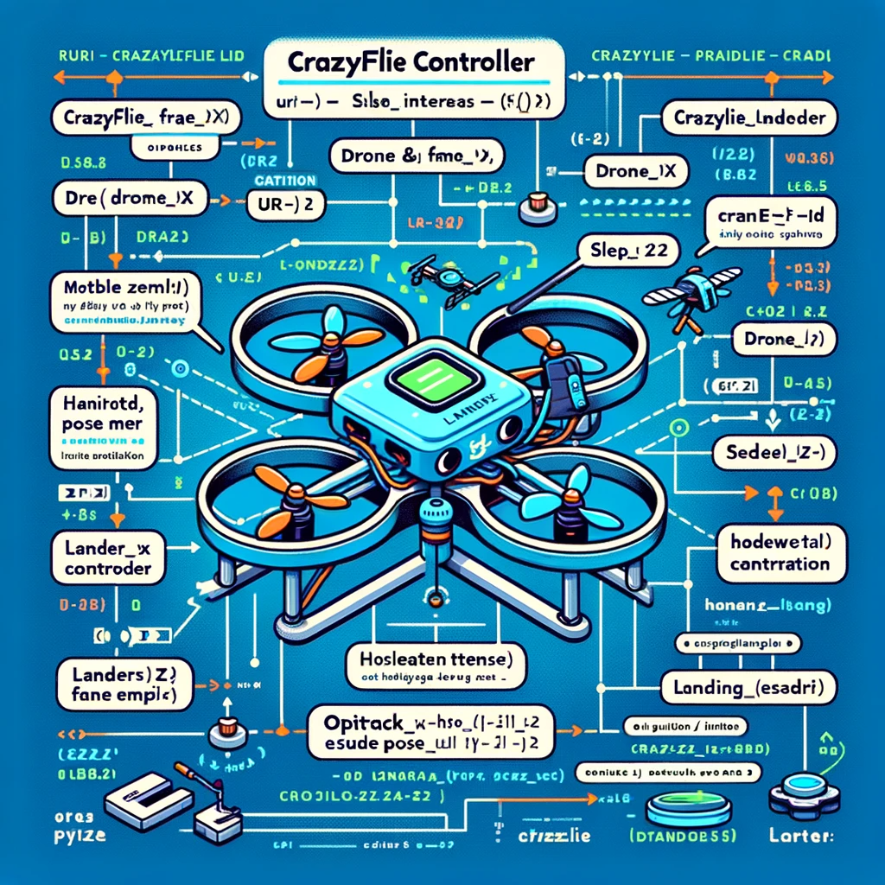
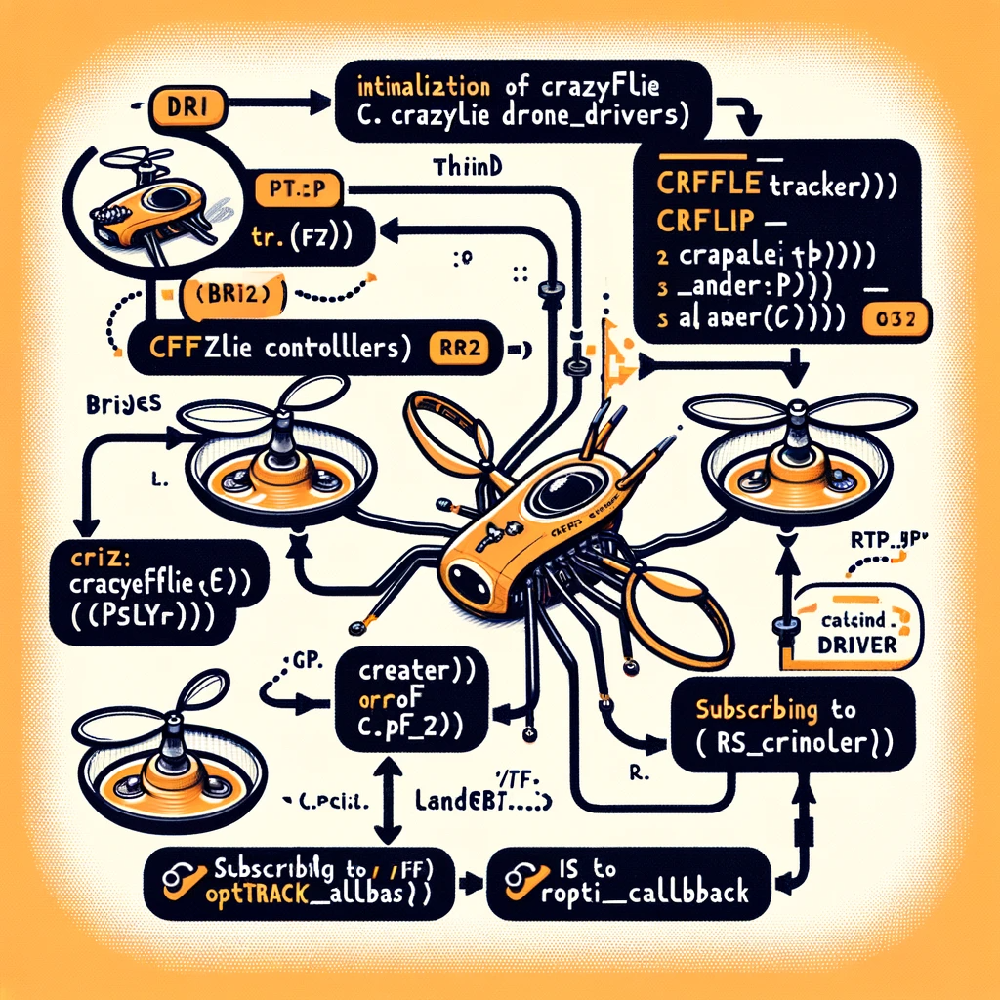

# crazyflie_ws
This repository is part of my class project at Intelligent Systems and Robotics department in UWF.

All the experiments were performed & executed in python & ROS. 

# Supplimental Repository
1. https://github.com/ArghyaChatterjee/natnet_ros_cpp/
2. https://github.com/bitcraze/aideck-gap8-examples
3. https://github.com/bitcraze/crazyflie-clients-python
