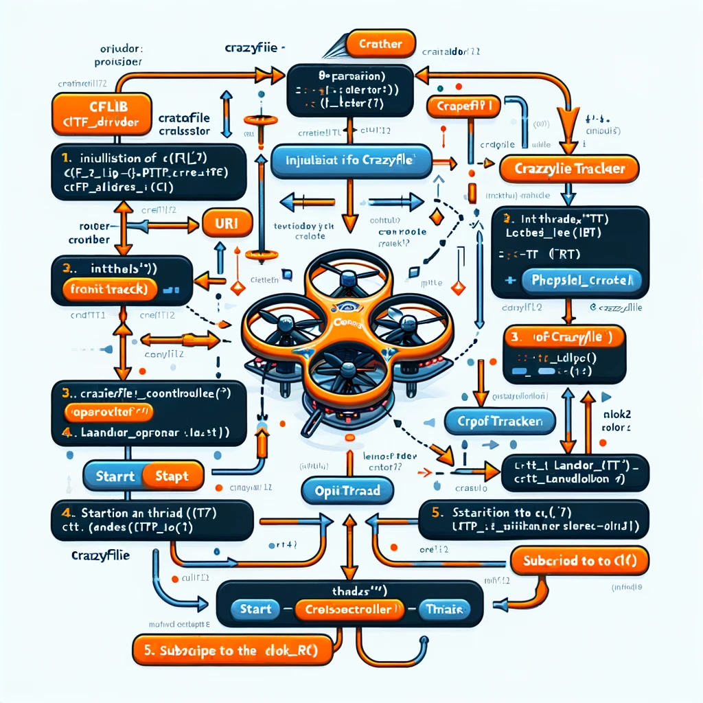
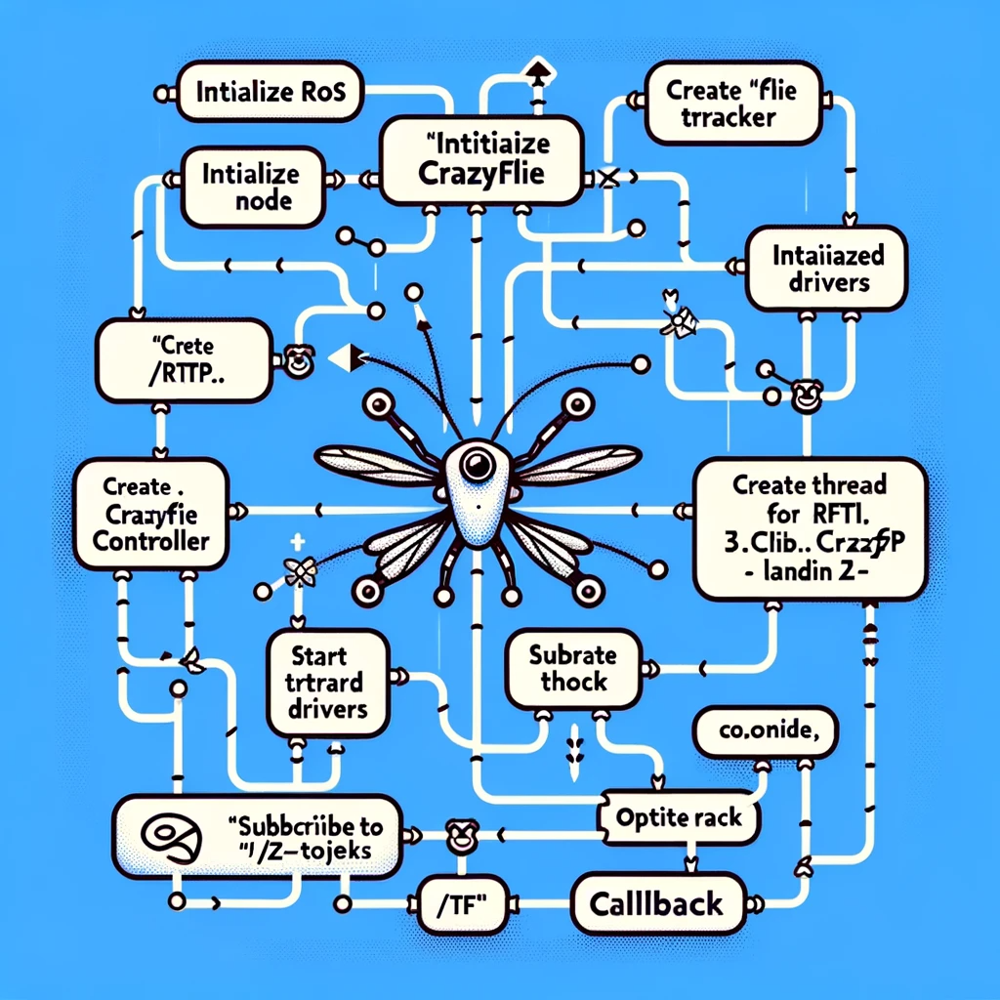
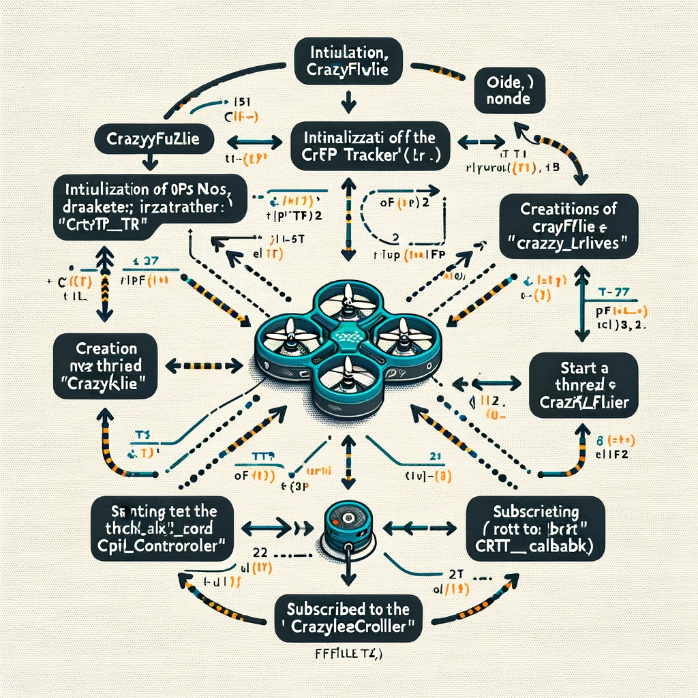

# crazyflie_ws
This repository is part of my class project at Intelligent Systems and Robotics department in UWF.

<!-- First Row -->
<p align="center">
  
   
</p>

<!-- Second Row -->
<p align="center">
  
  
</p>

<!-- Third Row -->
<p align="center">
  
</p>

All the experiments were performed & executed in python & ROS. 


## Overview
This README provides instructions for working with Crazyflies on Ubuntu, including running the Crazyflie program, understanding the Crazyflie tutorial, and various commands for controlling the Crazyflie drone.

## Running the Crazyflie Program
To run the Crazyflie client, use the following command:
```bash
python3 -m cfclient.gui
```

## Crazyflie Tutorial
- Communication URI: `radio://0/80/2M/E7E7E7E7E7`
- Crazyradio PA
  - CRTP (Crazyradio Real-Time Protocol)
  - Medium: Radio used
  - Channel: 10-120
  - Speed: Communication speed in bits per second
  - Address: Address of the individual Crazyflie drone
- Broadcasting to multiple Crazyflies is possible on the same channel.

## Internal Measurement Unit (IMU)
- Accelerometers: Measures acceleration in xyz directions.
- Gyroscope: Measures angular movement.
- Pressure Sensor: Used for height estimation (barometer is off by default).

## Additional Information
- Maximum carrying weight: 15 grams.
- Flow deck can fly up to 4 meters or 13 feet.
- 30x30 pixel camera on the flow deck with a 4.2-degree field of view.
- Initial coordinates are set where the Crazyflie starts.

## Swarm Control
- Broadcasting: Sending messages with no return expected.
- Supports multiple Crazyflies per Crazyradio using the same channel.
- Specific trajectories cannot be sent at each time step.
- Crazyflies need to autonomously handle more tasks.

## Flashing Multiple Crazyflies
- Go to `examples/demos/swarm_demo`.
- Include geometry settings.
- Use the `.sh` script for flashing all drones: `./cload_all.sh`.

## Crazyflie Movement Commands
### Synchronization and Motion
```python
with SyncCrazyflie(URI) as scf:
    with MotionCommander(scf) as mc:
        # Movement commands here
```
### Using the Flow Deck for Localization
- The drone maintains height relative to the surface beneath the flow deck.
- The flow deck may have stability issues at high speeds, especially in circles.
- Refer to the Crazyflie Python library for more details: [Crazyflie Documentation](https://www.bitcraze.io/documentation/repository/crazyflie-lib-python/master/api/cflib/positioning/motion_commander/)

### Motion Commander
- Default height for takeoff: `MotionCommander(crazyflie, default_height=0.3)`
- Parameters:
  - `crazyflie`: A Crazyflie or SyncCrazyflie instance.
  - `default_height`: Default height for flying.

### Basic Movement Functions
- `move_distance(self, distance_x_m, distance_y_m, distance_z_m, velocity=0.2)`: Move in a straight line.
- `start_linear_motion(self, velocity_x_m, velocity_y_m, velocity_z_m, rate_yaw=0.0)`: Start a linear motion with optional yaw rate.

### Start/Stop Functions
- `take_off(self, height=None, velocity=0.2)`: Takeoff function.
- `stop(self)`: Stop any motion and hover.
- `land(self, velocity=0.2)`: Land the drone.

### Movement in Different Directions
- `up(self, distance_m, velocity=0.2)`: Move up.
- `down(self, distance_m, velocity=0.2)`: Move down.
- `forward(self, distance_m, velocity=0.2)`: Move forward.
- `back(self, distance_m, velocity=0.2)`: Move backward.
- `left(self, distance_m, velocity=0.2)`: Move left.
- `right(self, distance_m, velocity=0.2)`: Move right.

### Circular Movements
- `circle_left(self, radius_m, velocity=0.2, angle_degrees=360.0)`: Circle counter-clockwise.
- `circle_right(self, radius_m, velocity=0.2, angle_degrees=360.0)`: Circle clockwise.

### Left Movements
- `left(self, distance_m, velocity=0.2)`: Move to the left.
- `start_left(self, velocity=0.2)`: Start moving left immediately.
- `turn_left(self, angle_degrees, rate=72.0)`: Turn left on the spot.
- `start_turn_left(self, rate=72.0)`: Begin turning left immediately.
- `circle_left(self, radius_m, velocity=0.2, angle_degrees=360.0)`: Circle counter-clockwise.
- `start_circle_left(self, radius_m, velocity=0.2)`: Start circular motion to the left immediately.

### Right Movements
- `right(self, distance_m, velocity=0.2)`: Move to the right.
- `start_right(self, velocity=0.2)`: Start moving right immediately.
- `turn_right(self, angle_degrees, rate=72.0)`: Turn right on the spot.
- `start_turn_right(self, rate=72.0)`: Begin turning right immediately.
- `circle_right(self, radius_m, velocity=0.2, angle_degrees=360.0)`: Circle clockwise.
- `start_circle_right(self, radius_m, velocity=0.2)`: Start circular motion to the right immediately.

### Move Up/Down
- `up(self, distance_m, velocity=0.2)`: Go upwards.
  - `distance_m`: The distance to travel upwards in meters.
  - `velocity`: The velocity of the upward motion in meters per second.
- `start_up(self, velocity=0.2)`: Start moving upwards immediately.
- `down(self, distance_m, velocity=0.2)`: Go downwards.
  - `distance_m`: The distance to travel downwards in meters.
  - `velocity`: The velocity of the downward motion in meters per second.
- `start_down(self, velocity=0.2)`: Start moving downwards immediately.

### Move Forward/Back
- `forward(self, distance_m, velocity=0.2)`: Go forwards.
  - `distance_m`: The distance to travel forward in meters.
  - `velocity`: The velocity of the forward motion in meters per second.
- `start_forward(self, velocity=0.2)`: Start moving forward immediately.
- `back(self, distance_m, velocity=0.2)`: Go backwards.
  - `distance_m`: The distance to travel backward in meters.
  - `velocity`: The velocity of the backward motion in meters per second.
- `start_back(self, velocity=0.2)`: Start moving backward immediately.

For more detailed information, refer to the full PDF document on working with Crazyflies on Ubuntu.

# Supplimental Repository
1. https://github.com/ArghyaChatterjee/natnet_ros_cpp/
2. https://github.com/bitcraze/aideck-gap8-examples
3. https://github.com/bitcraze/crazyflie-clients-python
4. https://www.bitcraze.io/documentation/repository/crazyflie-lib-python/master/api/cflib/positioning/motion_commander/
